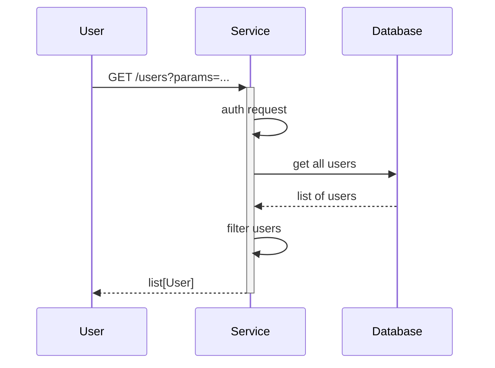

# Vaccination Eligibility Data Product

[](https://github.com/NHSDigital/eligibility-signposting-api/actions/workflows/cicd-1-pull-request.yaml)
[](https://sonarcloud.io/summary/new_code?id=repository-template)

The Eligibility Signposting API and Eligibility Data Product are designed to be the single source of the truth for providing trustworthy assessments of an individual’s eligibility based upon clinically assured data sources, for one or more vaccinations. It will also provide details about whether the individual can book/get a vaccine and how they can get vaccinated where relevant.

Initially this will support inclusion of eligibility for Respiratory Syncytial Virus (RSV) vaccination for older adults within the NHS App (Vaccinations in the App).

The software will only be used for signposting an individual to an appropriate service. Ultimately the eligibility for a particular vaccination will be decided by a healthcare professional at the point of care prior to giving the vaccination.

## Table of Contents

- [Vaccination Eligibility Data Product](#vaccination-eligibility-data-product)
  - [Table of Contents](#table-of-contents)
  - [Setup](#setup)
    - [Prerequisites](#prerequisites)
    - [Configuration](#configuration)
  - [Usage](#usage)
    - [Testing](#testing)
  - [Design](#design)
    - [Diagrams](#diagrams)
    - [Modularity](#modularity)
  - [Contributing](#contributing)
  - [Contacts](#contacts)
  - [Licence](#licence)

## Setup

First, ensure [Pprerequisites](#prerequisites) are met. Then clone the repository, and install dependencies.

```shell
git clone https://github.com/NHSDigital/eligibility-signposting-api.git
cd eligibility-signposting-api
make dependencies install-python
```

### Prerequisites

The following software packages, or their equivalents, are expected to be installed and configured:

- [Python](http://python.org) version 3.13. (It may be easiest to use [pyenv](https://github.com/pyenv/pyenv) to manage Python versions.)
- [Docker](https://www.docker.com/) container runtime or a compatible tool, e.g. [colima](https://github.com/abiosoft/colima) or  [Podman](https://podman.io/),
- [asdf](https://asdf-vm.com/) version manager,
- [GNU make](https://www.gnu.org/software/make/) 3.82 or later,

> [!NOTE]<br>
> The version of GNU make available by default on macOS is earlier than 3.82. You will need to upgrade it or certain `make` tasks will fail. On macOS, you will need [Homebrew](https://brew.sh/) installed, then to install `make`, like so:
>
> ```shell
> brew install make
> ```
>
> You will then see instructions to fix your [`$PATH`](https://github.com/nhs-england-tools/dotfiles/blob/main/dot_path.tmpl) variable to make the newly installed version available. If you are using [dotfiles](https://github.com/nhs-england-tools/dotfiles), this is all done for you.

- [GNU sed](https://www.gnu.org/software/sed/) and [GNU grep](https://www.gnu.org/software/grep/) are required for the scripted command-line output processing,
- [GNU coreutils](https://www.gnu.org/software/coreutils/) and [GNU binutils](https://www.gnu.org/software/binutils/) may be required to build dependencies like Python, which may need to be compiled during installation,

> [!NOTE]<br>
> For macOS users, installation of the GNU toolchain has been scripted and automated as part of the `dotfiles` project. Please see this [script](https://github.com/nhs-england-tools/dotfiles/blob/main/assets/20-install-base-packages.macos.sh) for details.

- [Python](https://www.python.org/) required to run Git hooks,
- [`jq`](https://jqlang.github.io/jq/) a lightweight and flexible command-line JSON processor.

### Configuration

None so far!

## Usage

After a successful installation, provide an informative example of how this project can be used. Additional code snippets, screenshots and demos work well in this space. You may also link to the other documentation resources, e.g. the [User Guide](./docs/user-guide.md) to demonstrate more use cases and to show more features.

### Testing

Run all tests and linting:

```shell
make precommit
```

There are `make` tasks for you to configure to run your tests.  Run `make test` to see how they work.  You should be able to use the same entry points for local development as in your CI pipeline.

## Design

We'll be separating our [presentation](https://martinfowler.com/eaaDev/SeparatedPresentation.html) layer (where API logic lives, in [`views/`](src/eligibility_signposting_api/views)), [business services](https://martinfowler.com/eaaCatalog/serviceLayer.html) layer (where business logic lives, in [`services/`](src/eligibility_signposting_api/services)) and [repository](https://martinfowler.com/eaaCatalog/repository.html) layer (where database logic lives, [`repos/`](src/eligibility_signposting_api/repos)). We will be using [wireup](https://pypi.org/project/wireup/) for [dependency injection](https://pinboard.in/u:brunns/t:dependency-injection), so services get their dependencies given to them ("injection"), and wireup takes care of that. (We'll usually use the [`@service` annotation](https://maldoinc.github.io/wireup/latest/services/), but [factory functions](https://maldoinc.github.io/wireup/latest/factory_functions/) will be used where necessary, typically for creating resources from 3rd party libraries.)  We'll be using [Pydantic](https://pypi.org/project/pydantic/) for both response models and database models.

[app.py](src/eligibility_signposting_api/app.py) is the best place to start exploring the code.

Local tests will use [localstack](https://www.localstack.cloud/), started & stopped using [pytest-docker](https://pypi.org/project/pytest-docker/). We'll make extensive use of [pytest fixtures](https://docs.pytest.org/en/6.2.x/fixture.html), [builders](https://pypi.org/project/factory-boy/) and [matchers](https://pypi.org/project/pyhamcrest/) to keep our tests clean.

### Diagrams

The [C4 model](https://c4model.com/) is a simple and intuitive way to create software architecture diagrams that are clear, consistent, scalable and most importantly collaborative. This should result in documenting all the system interfaces, external dependencies and integration points.


The source for diagrams should be in Git for change control and review purposes. Recommendations are [draw.io](https://app.diagrams.net/) (example above in [docs](.docs/diagrams/) folder) and [Mermaids](https://github.com/mermaid-js/mermaid). Here is an example Mermaids sequence diagram:



### Modularity

Most of the projects are built with customisability and extendability in mind. At a minimum, this can be achieved by implementing service level configuration options and settings. The intention of this section is to show how this can be used. If the system processes data, you could mention here for example how the input is prepared for testing - anonymised, synthetic or live data.

## Contributing

Describe or link templates on how to raise an issue, feature request or make a contribution to the codebase. Reference the other documentation files, like

- Environment setup for contribution, i.e. `CONTRIBUTING.md`
- Coding standards, branching, linting, practices for development and testing
- Release process, versioning, changelog
- Backlog, board, roadmap, ways of working
- High-level requirements, guiding principles, decision records, etc.

## Contacts

Please contact the team on [Slack](https://nhsdigitalcorporate.enterprise.slack.com/archives/C08ATG7TBDW)

## Licence

> The [LICENCE.md](./LICENCE.md) file will need to be updated with the correct year and owner

Unless stated otherwise, the codebase is released under the MIT License. This covers both the codebase and any sample code in the documentation.

Any HTML or Markdown documentation is [© Crown Copyright](https://www.nationalarchives.gov.uk/information-management/re-using-public-sector-information/uk-government-licensing-framework/crown-copyright/) and available under the terms of the [Open Government Licence v3.0](https://www.nationalarchives.gov.uk/doc/open-government-licence/version/3/).
